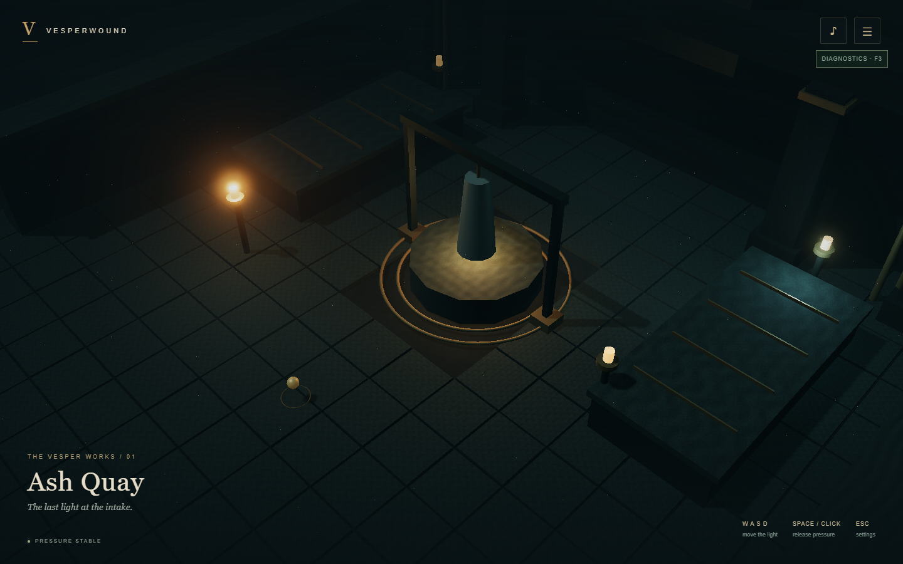
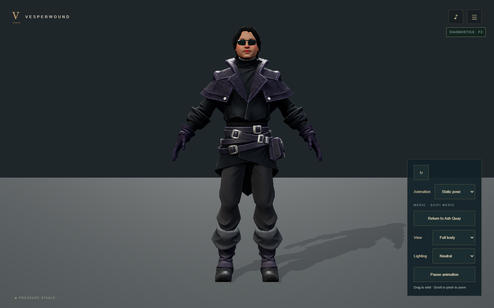
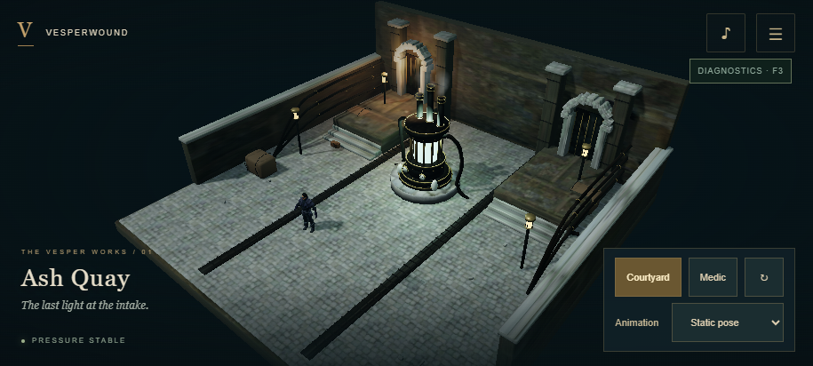

# Retained visual milestone comparisons

The user accepted Medic on 2026-10-06. [Source/browser gallery](qa/medic/comparison.html) compares the supplied asset with Blender and actual WebGPU/WebGL2 renders. The old generated character and its comparisons have been removed.

## Original technical courtyard

## Medic in the browser

## Ash Quay on WebGPU

## Mobile landscape

These are actual browser captures. Mobile emulation verifies layout and compatibility, not physical-phone performance. The supplied files have no animation clips; the visible pose is static.
