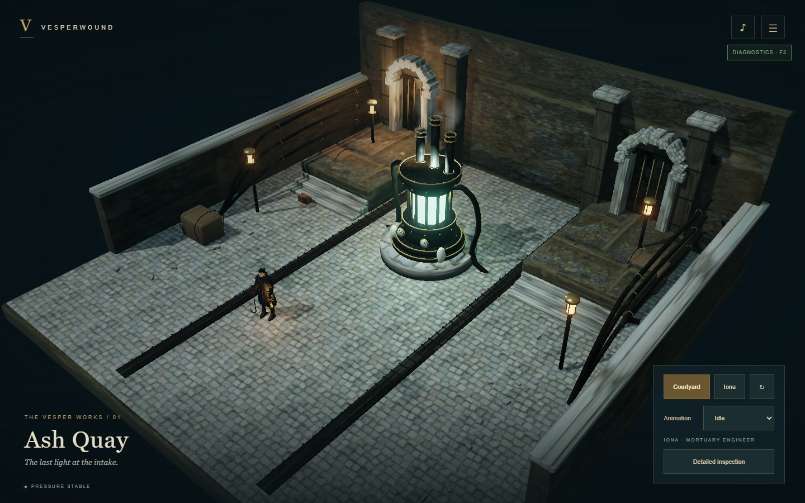
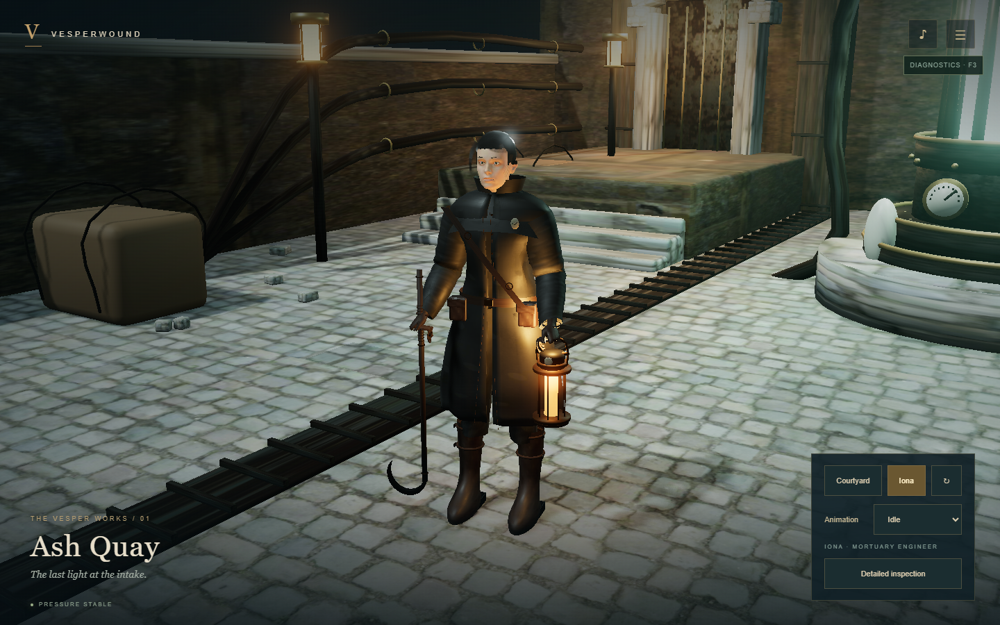
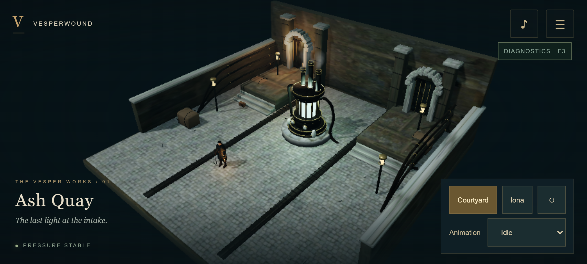

# Visual milestone comparisons

These are actual Chrome game renders. Concept illustrations are retained separately in `art/references` and are not browser screenshots.

## Original technical courtyard

## Ash Quay on WebGPU

## Iona on WebGPU

## WebGL2 and phone landscape layout

Additional front/side/back and idle/walk/run/attack/dodge captures are in `docs/qa/visual`. Emulation verifies layout and rendering compatibility; it is not physical phone performance evidence.
